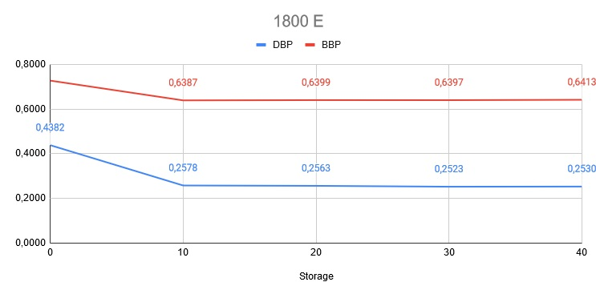
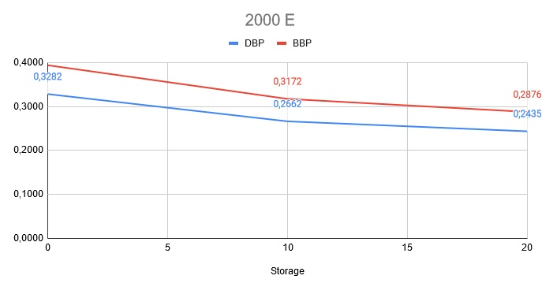

# Rouspaumcation

Simulation program designed to solve problem of dynamic routing, space and spectrum allocation (RSSA) of unicast demands in flex-grid network with assistive sotrage.

Needed data set:
- .net file with network dimensions: number of nodes, links and adjacent matrix,
- .pat file with k candidate paths (k can be set up in code),
- .spec file with number of slices needed for each path in .pat file,
- .dem files with demands (income iteration, source, target, bitrate and duration).

# Project

The aim of the project is to propose new created method to solve RSSA problem (Dynamic Routing Space and Spectrum Allocation) with assistive storage. The method consists in creating candidate demand sets for each spectrally-spatially resources and selecting those demands that limit available resources for the fewest other demands. It has been described in detail through the criteria for creating such sets, and a simulation program has been implemented to test it for different traffic volumes. This gives the opportunity to measure how beneficial it is to use assistive storage in various cases.

## Introduction

Many observations show that Internet traffic is growing faster and faster. The introducing technologies will bring about many changes. A good example is 5G technology, which in 2023 will reach speeds around 13 times faster than mobile traffic in 2018 [1].

The technology that can cope with such an increase in network bandwidth demand is concept of spectrally-spatially flexible optical networks (SS-FONs). It implements space division multiplexing (SDM) [2] with elastic optical networks (EON), what brings benefits like enormous increase in transmission capacity [3, 4]. It is also opportunity to manage network resource in more flexible way.

It works by discretization the optical spectrum in frequency slots (FSs) of 12.5 GHz width [5]. By concatenating multiple adjacent Sub-Channels (Sb-Chs) it is possible to form Super-Channel (SCh) that enables ultra-high bit-rate transmissions [6, 7].

According to [1], the global average broadband speed is growing, from 45.9 Mbps in 2018 to 110.4 Mbps in 2023. This is one of the key indicators of increased IP traffic. This raises the need to find better methods of planning unicast traffic using existing infrastructure. The attempt to meet these requirements is working on dynamic routing, spectrum and space allocation (RSSA) problem. The aim is to find for each request a routing path, spatial cores and optical channel. It is also possible to determine a modulation level and handle with routing, modulation level, space and spectrum allocation (RMLSSA) [8], but in this paper modulation level is pre-determined. Many publication consider also routing and spectrum allocation (RSA) problem. 

RSSA problem is to find a lightpath in SS-FONs scenario, what requires to focus on spectrum and space allocation in the same time for incoming requests. There are many ways to solve this problem, what we present in the next chapters. We want to create new method basing on probability of using a specific resource of space and spectrum for unicast requests. In this paper we want to describe proposed algorithm and present its implementation. Next we want to conduct research and compare results with results obtained by the SSA algorithm.

## Related works

The subject of this article is quite a new field of Internet traffic engineering. Nevertheless, many works have been prepared proposing various approaches to the problem of allocation of the discussed resourches.

In many works RSSA problem is studied with using integer linear programming (ILP) [4, 7, 9, 10] Formulating this problem as ILP model provides to solve optimization problem with decision variables. Hovewer, this technique is low scalability. Mathematical programming (MP) methods for larger instances of complex problems don't provide results in a reasonable time [3].

Another way is using heuristic or metaheuristic algorithms, which are faster, but not always reach optimal solution of a problem.

Fixed-Alternate routing and First-Fit frequency assignment (FA-FF) algorithm is proposed in [11]. In [7] authors propose effective heuristic method called Adaptive Frequency Assignment - Collision Avoidance (AFA-CA). In this method the main aim is to select the sequence of processed demands in order to minimize the spectrum use. In [12] authors propose two algorithms solving RSSA-DPP (Dedicated Path Protection) problem using evolutionary algorithm and tabu search. Three different heuristic algorithms called spectrum waste base (SWB) algorithm, intentional spectrum waste with sequential approach (ISW-S) algorithm and intentional spectrum waste with accumulative approach (ISW-A) are proposed in [8] using spectrum waste metric. Another heuristic is developed in [13], basing on the greedy randomized adaptive search procedure authors propose GRASP metaheuristic approach. They also propose adaptive search procedure (SA) to solve larger instances of the RSSA problem. In [14] authors propose another algorithm using greedy heuristic. Another algorithms are: a variable-group-base (MVG) algorithm [15], a minimum-block-generated flexible-grouping-based (MBFG) spectrum assignment algorithm [16] and an SLA-provisioning algorithm (SADQ) that employs multilevel differentiation to provision the proposed service level agreement (SLA) parameters [17].

The last way to solve discussed problem is to use the techniques of artificial intelligence (AI). In [18] described is using AI in optical networks, what can improve the configuration and operation of network devices, optical performance monitoring and quality of transmission (QoT) estimation. AI systems gives opportunities for automating operations and introducing intelligence decisions by planning use and management of network resources.

## Problem definition, Nomenclature, Description of the method

To read this sections, please, render file README.ipynb. There is LATEX code, which is not rendered by Github on main page of projects.

## Research plan and simulation program

In order to test the possibilities of the method proposed by us in the previous chapter, it is necessary to create a tool that will enable simulations.

### Simulation program
Descibed method was implemented in created simulation program. We chose Python 3.9 with tool Numpy thanks to which we could easily store and manipulate data in arrays.

### Data sets
We also got a simulation data for traffics volumes from 100 E to 2000 E, 10 data sets for each traffic volume. The data covers 2000 iterations over a network with 16 nodes and 48 links. There are also 30 candidate paths between each two network nodes.

We can compare our results with the results of the SSA algorithm for 7 cores and 30 candidate paths between each two network nodes.

### Research plan

Conducting a simulation for a network with the same parameters as the one for which we have the results of the SSA algorithm, takes too much time and exceeds our capabilities.

We decided to run simulations for networks with much lower parameters. In our research, we limited the number of cores to 2, and we limited the number of candidate paths to 3. As a result, the time needed to perform a single simulation ranges from 1 hour to 25 hours depending on the traffic volume (from about 2 seconds per iteration to about 40 seconds per iteration).

## Conducted research and results

The SSA algorithm for traffic volumes up to 1000 E did not report any rejected requests. The results may be different in a lower-performing network. We want to use our method to check whether any requests will be rejected without using assistive storage and how it will change with assistive storage of different sizes.  We will perform this test for traffic volumes of 300 E, 400 E, 500 E and 600 E. Thanks to this comparison, we will see how the use of assistive storage affects the allocation of requests.

 

 

| Traffic | Test | Pd       | K       | Storage | All bitrate | Served bitrate | Rejected bitrate | All demands | Served demands | Rejected demands | DBP    | BBP    |
|---------|------|----------|---------|---------|-------------|----------------|------------------|-------------|----------------|------------------|--------|--------|
| 300     | 1    | 3        | 2       | 0       | 15107220    | 14951401       | 155819           | 28976       | 28688          | 288              | 0,0099 | 0,0103 |
|         |      |          |         | 10      | 15107220    | 14951401       | 155819           | 28976       | 28688          | 288              | 0,0099 | 0,0103 |
|         |      |          |         | 30      | 15107220    | 14951401       | 155819           | 28976       | 28688          | 288              | 0,0099 | 0,0103 |
| 400     | 1    | 3        | 2       | 0       | 15104870    | 14900784       | 204086           | 28976       | 28594          | 382              | 0,0132 | 0,0135 |
|         |      |          |         | 10      | 15104870    | 14900784       | 204086           | 28976       | 28594          | 382              | 0,0132 | 0,0135 |
| 500     | 1    | 3        | 2       | 0       | 15097904    | 14839532       | 258372           | 28976       | 28491          | 485              | 0,0167 | 0,0171 |
|         |      |          |         | 10      | 15097904    | 14839532       | 258372           | 28976       | 28491          | 485              | 0,0167 | 0,0171 |
| 600     | 1    | 3        | 2       | 0       | 15098323    | 1493859        | 13604464         | 28976       | 28400          | 576              | 0,0199 | 0,9011 |
|         |      |          |         | 10      | 15098323    | 1493859        | 13604464         | 28976       | 28400          | 576              | 0,0199 | 0,9011 |
|         |      |          |         | 20      | 15098323    | 1493859        | 13604464         | 28976       | 28400          | 576              | 0,0199 | 0,9011 |
| 1000    | 1    | 3        | 2       | 0       | 15098139    | 12442521       | 2655618          | 28976       | 24991          | 3985             | 0,1375 | 0,1759 |
|         |      |          |         | 10      | 15098139    | 13660835       | 1437304          | 28976       | 26721          | 2255             | 0,0778 | 0,0952 |
|         |      |          |         | 20      | 15098139    | 14006028       | 1092111          | 28976       | 27210          | 1766             | 0,0609 | 0,0723 |
| 1300    | 1    | 3        | 2       | 0       | 15134248    | 11203183       | 3931065          | 28976       | 22937          | 6039             | 0,2084 | 0,2597 |
|         |      |          |         | 10      | 15134248    | 11258735       | 3875513          | 28976       | 23007          | 5969             | 0,2060 | 0,2561 |
|         |      |          |         | 20      | 15134248    | 11258735       | 3875513          | 28976       | 23007          | 5969             | 0,2060 | 0,2561 |
|         |      |          |         | 30      | 15134248    | 11258735       | 3875513          | 28976       | 23007          | 5969             | 0,2060 | 0,2561 |
| 1500    | 1    | 3        | 7       | 0       | 15170426    | 15136327       | 34099            | 28976       | 27475          | 1501             | 0,0518 | 0,0022 |
| 1800    | 1    | 3        | 2       | 0       | 30115206    | 8217437        | 21897769         | 28976       | 16278          | 12698            | 0,4382 | 0,7271 |
|         |      |          |         | 10      | 30115206    | 10881946       | 19233260         | 28976       | 21506          | 7470             | 0,2578 | 0,6387 |
|         |      |          |         | 20      | 30115206    | 10844820       | 19270386         | 28976       | 21550          | 7426             | 0,2563 | 0,6399 |
|         |      |          |         | 30      | 30115206    | 10851561       | 19263645         | 28976       | 21664          | 7312             | 0,2523 | 0,6397 |
|         |      |          |         | 40      | 30115206    | 10801027       | 19314179         | 28976       | 21645          | 7331             | 0,2530 | 0,6413 |
| 2000    | 1    | 3        | 2       | 0       | 15104625    | 9157159        | 5947466          | 28976       | 19466          | 9510             | 0,3282 | 0,3938 |
|         |      |          |         | 10      | 15104625    | 10313211       | 4791414          | 28976       | 21263          | 7713             | 0,2662 | 0,3172 |
|         |      |          |         | 20      | 15104625    | 10760596       | 4344029          | 28976       | 21919          | 7057             | 0,2435 | 0,2876 |

We also want to check what the results will be for higher traffic volumes. We chose 1000 E, 1300 E, 1800 E and 2000 E. Similar simulations will be performed to check how the number of rejected demands changes depending on the size of assistive storage.

We also conducted only one test with 7 cores for traffic volume of 1500 E, but with only 3 candidate paths for each demand. Thanks to it we can see, what is the different between our results and SSA algorithm's results, remembering about different number of candidate paths.

## Conclusions

The most important conclusion is that the designed method is not useful in real cases. The linear dependence of the calculation time on the network parameters allows only basic simulations to be made.

Other methods, such as linear programming, use matrix and number operations. Their computation times are much shorter. Our method requires searching resource and request sets, which greatly increases the number of instructions that the program has to execute.

Despite the few results obtained with our simulation program, we can draw conclusions regarding the use of assistive storage.

Based on the results obtained for low traffic:
* if the number of rejected demands without the use of assistive storage is low, using assistive storage does not improve the results. This is evidenced by the results obtained for the traffic volumes of 300 E - 600 E.

Based on the results obtained for high traffic:
* if the number of rejected demands without the use of assistive storage is high, the use of base assistive storage significantly reduces the number of rejected demands and reduces the DBP and BBP values. Further increasing the size of assistive storage only slightly improves the results. This is evidenced by the results obtained for the traffic volume of 1000 E, 1300 E and 1800 E,
* using assistive storage increases the number of operations and the computation time. This is because there are more candidate demands to allocate resources.

Based on the results obtained for 7 cores:
* the created method copes well with assigning resources to successive demands. The presented results are for networks with worse parameters. The result obtained for 1500 E rejected 1501 demands, and for the same data and the same network, but with 10 times more candidate paths, the SSA algorithm rejected 567 demands. We could not run the test for the 30 candidate paths as it would take 10 times longer.

## References
[1]: CISCO, “Cisco Annual Internet Report (2018-2023) White Paper,”CISCO, Tech. Rep., 2020.

[2]: W. KmiecikandK.Walkowiak,“A performance study of dynamic routing algorithm for sdm translucent optical networks with assistive storage,”Optical Switching and Networking,vol. 38, p. 100572, 2020. [Online]. Available: http://www.sciencedirect.com/science/article/pii/S157342771930150X

[3]: M. Klinkowski,P. Lechowicz, and K. Walkowiak, “Survey of resource allocation schemes and algorithms in spectrally-spatially flexible optical networking,”Optical Switching and Networking, vol. 27, pp. 58 – 78, 2018. [Online]. Available: http://www.sciencedirect.com/science/article/pii/S157342771730053X

[4]: B. Chatterjee, N. Sarma, and E. Oki, “Routing and spectrum allocationin elastic optical networks: A tutorial, ”IEEE Communications Surveysamp Tutorials, vol. 17, pp. 1776–1800, 07 2015.

[5]: International Telecommunication Union - ITU-T, “G.694.1 (02/2012), spectral grids for WDM applications: DWDM frequency grid,” Tech. Rep., 2012.

[6]: R. Rumipamba-Zambrano, F.-J. Moreno-Muro, J. Perelló, P. Pavón-Mariño, S. Spadaro, “Space continuity constraint in dynamic flex-grid/sdm optical core networks: An evaluation withspatial and spectral super-channels, ”Computer Communications,vol. 126, pp. 38–49, 2018. [Online]. Available: http://www.sciencedirect.com/science/article/pii/S0140366417310162

[7]: M. Klinkowski and K. Walkowiak, “Routing and spectrum assignment in spectrum sliced elastic optical path network, ”IEEE Communications Letters, vol. 15, pp. 884–886, 08 2011.

[8]: A. Ghadesi, A. Ghaffarpour Rahbar, M. Yaghubi-Namaad, and A. Abi, “Intentional spectrum waste to reduce blocking probability in space division multiplexed elastic optical networks, ”Optical Fiber Technology, vol. 52, p. 101968, 2019. [Online]. Available: http://www.sciencedirect.com/science/article/pii/S1068520019301051

[9]: R. Goścień and P. Lechowicz, “On the complexity of RSSA of anycast demands in spectrally-spatially flexible optical networks,” in INOC, 2019.

[10]: D. T. Hai, “On routing, spectrum and network coding assignment problem for transparent flex-grid optical networks with dedicated protection, ”Computer Communications, vol. 147, pp. 198 – 208, 2019. [Online]. Available: http://www.sciencedirect.com/science/article/pii/S0140366418306546

[11]: M. Jinno, B. Kozicki, H. Takara, A. Watanabe, Y. Sone, T. Tanaka, and A. Hirano, “Distance-adaptive spectrum resource allocation in spectrum-sliced elastic optical path network [topics in optical communications], ”IEEE Communications Magazine, vol. 48, no. 8, pp. 138–145, 2010.

[12]: M. W. Przewozniczek, R. Goścień, P. Lechowicz, and K. Walkowiak, “Metaheuristic algorithms with solution encoding mixing for effective optimization of sdm optical networks, ”Engineering Applications of Artificial Intelligence, vol. 95, p. 103843, 2020. [Online]. Available: http://www.sciencedirect.com/science/article/pii/S0952197620302074

[13]: P. Lechowicz, K. Walkowiak, and M. Klinkowski, “Greedy randomized adaptive search procedure for joint optimization of unicast and anycast traffic in spectrally-spatially flexible optical networks, ”Computer Networks, vol. 146, pp. 167 – 182, 2018. [Online]. Available: http://www.sciencedirect.com/science/article/pii/S1389128618308995

[14]: R. Rumipamba-Zambrano, J. Perell ́o, J. M. Gen ́e, and S. Spadaro, “On the scalability of dynamic flex-grid/sdm optical core networks, ”Computer Networks, vol. 142, pp. 208 – 222, 2018. [Online]. Available: http://www.sciencedirect.com/science/article/pii/S1389128618303712

[15]: Y. Qiu, “An efficient spectrum assignment algorithm based on variable-grouping mechanism for flex-grid optical networks, ”Optical Switching and Networking, vol. 24, pp. 39 – 46, 2017. [Online]. Available: http://www.sciencedirect.com/science/article/pii/S1573427716300467

[16]: Y. Qiu and J. Xu, “Minimum-block-generated flexible-grouping-based spectrum assignment for flex-grid optical networks, ”Optical Fiber Technology, vol. 38, pp. 51 – 60, 2017. [Online]. Available: http://www.sciencedirect.com/science/article/pii/S1068520017302572

[17]: A. Agrawal, U. Vyas, V. Bhatia, and S. Prakash, “Sla-aware differentiated qos in elastic optical networks, ”Optical FiberTechnology, vol. 36, pp. 41 – 50, 2017. [Online]. Available: http://www.sciencedirect.com/science/article/pii/S1068520017300536

[18]: J. Mata, I. de Miguel, R. J. Dur ́an, N. Merayo, S. K. Singh, A. Jukan, and M. Chamania, “Artificial intelligence (ai) methods in optical networks: A comprehensive survey, ”Optical Switchingand Networking, vol. 28, pp. 43 – 57, 2018. [Online]. Available: http://www.sciencedirect.com/science/article/pii/S157342771730231X
